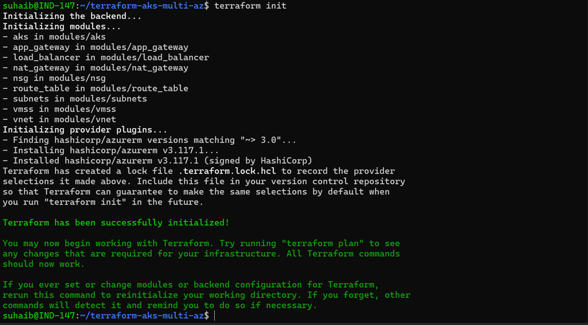
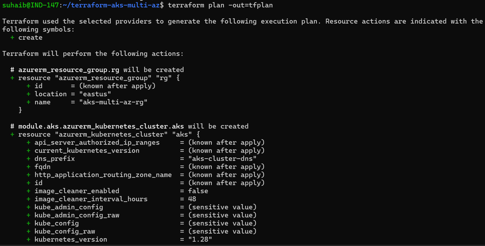
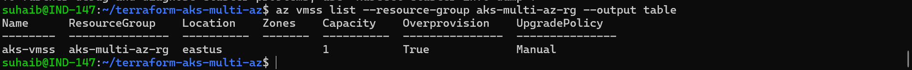
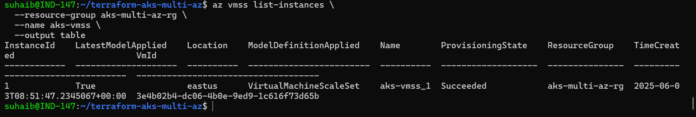

# AKS Multi-Zone Terraform Infrastructure

[](https://www.terraform.io/)
[](https://azure.microsoft.com/en-us/services/kubernetes-service/)
[](LICENSE)

A comprehensive Terraform solution for deploying a production-ready, multi-zone Azure Kubernetes Service (AKS) cluster with supporting infrastructure components.

## 🏗️ Architecture Overview

This project creates a complete AKS infrastructure with:
- **High Availability**: Multi-zone deployment across 3 availability zones
- **Scalability**: Virtual Machine Scale Sets with auto-scaling
- **Security**: Network Security Groups with proper ingress/egress rules
- **Load Balancing**: Application Gateway and Load Balancer for traffic distribution
- **Monitoring**: Integrated Log Analytics for cluster monitoring

## 📋 Prerequisites

### System Requirements
- **Operating System**: Debian WSL2 on Windows (or Linux/macOS)
- **Azure Subscription**: Active subscription with Contributor permissions
- **Tools**: curl, unzip, gnupg, lsb-release

### Required Permissions
- Contributor role on target Azure subscription
- Ability to create service principals
- Resource creation permissions in target region

## 🚀 Quick Start

### 1. Environment Setup

```bash
# Update system packages
sudo apt update && sudo apt upgrade -y
sudo apt install -y curl unzip gnupg lsb-release

# Install Azure CLI
curl -sL https://aka.ms/InstallAzureCLIDeb | sudo bash
az --version
az login

# Install Terraform
wget https://releases.hashicorp.com/terraform/1.12.1/terraform_1.12.1_linux_amd64.zip
unzip terraform_1.12.1_linux_amd64.zip
sudo mv terraform /usr/local/bin/
terraform version
```

### 2. Azure Authentication Setup

```bash
# Get subscription ID
az account show --query id -o tsv

# Create service principal
az ad sp create-for-rbac \
  --name "terraform-sp" \
  --role="Contributor" \
  --scopes="/subscriptions/YOUR_SUBSCRIPTION_ID"

# Set environment variables
export ARM_SUBSCRIPTION_ID="your-subscription-id"
export ARM_CLIENT_ID="your-app-id"
export ARM_CLIENT_SECRET="your-password"
export ARM_TENANT_ID="your-tenant-id"

# Make persistent
echo "export ARM_SUBSCRIPTION_ID=\"$ARM_SUBSCRIPTION_ID\"" >> ~/.bashrc
echo "export ARM_CLIENT_ID=\"$ARM_CLIENT_ID\"" >> ~/.bashrc
echo "export ARM_CLIENT_SECRET=\"$ARM_CLIENT_SECRET\"" >> ~/.bashrc
echo "export ARM_TENANT_ID=\"$ARM_TENANT_ID\"" >> ~/.bashrc
source ~/.bashrc
```

### 3. Deploy Infrastructure

```bash
# Clone repository
git clone <your-repo-url>
cd terraform-aks-multi-az

# Generate SSH key for VMs
ssh-keygen -t rsa -b 4096 -f ~/.ssh/id_rsa -N ""

# Initialize Terraform
terraform init

# Plan deployment
terraform plan -out=tfplan

# Apply configuration
terraform apply tfplan
```




## 📁 Project Structure

```
terraform-aks-multi-az/
├── modules/
│   ├── vnet/                    # Virtual Network module
│   │   ├── main.tf
│   │   ├── variables.tf
│   │   └── outputs.tf
│   ├── subnets/                 # Subnets module
│   │   ├── main.tf
│   │   ├── variables.tf
│   │   └── outputs.tf
│   ├── nsg/                     # Network Security Groups
│   │   ├── main.tf
│   │   ├── variables.tf
│   │   └── outputs.tf
│   ├── route_table/             # Route Tables module
│   │   ├── main.tf
│   │   ├── variables.tf
│   │   └── outputs.tf
│   ├── nat_gateway/             # NAT Gateway module
│   │   ├── main.tf
│   │   ├── variables.tf
│   │   └── outputs.tf
│   ├── app_gateway/             # Application Gateway module
│   │   ├── main.tf
│   │   ├── variables.tf
│   │   └── outputs.tf
│   ├── load_balancer/           # Load Balancer module
│   │   ├── main.tf
│   │   ├── variables.tf
│   │   └── outputs.tf
│   ├── vmss/                    # Virtual Machine Scale Set
│   │   ├── main.tf
│   │   ├── variables.tf
│   │   └── outputs.tf
│   └── aks/                     # AKS Cluster module
│       ├── main.tf
│       ├── variables.tf
│       └── outputs.tf
├── main.tf                      # Root module
├── variables.tf                 # Root variables
├── outputs.tf                   # Root outputs
├── terraform.tfvars             # Variable values
└── README.md                    # This file
```

## 🔧 Module Documentation

### VNET Module

Creates a virtual network with specified address space.

**Location**: `modules/vnet`

**Inputs**:
| Name | Description | Type | Default | Required |
|------|-------------|------|---------|----------|
| vnet_name | Name of the virtual network | string | n/a | yes |
| address_space | Address space for the VNET | list(string) | n/a | yes |
| location | Azure region | string | n/a | yes |
| resource_group_name | Resource group name | string | n/a | yes |
| tags | Tags for resources | map(string) | {} | no |

**Outputs**:
| Name | Description |
|------|-------------|
| vnet_id | ID of the VNET |
| vnet_name | Name of the VNET |

**Usage**:
```hcl
module "vnet" {
  source = "./modules/vnet"
  
  vnet_name           = "my-vnet"
  address_space       = ["10.0.0.0/16"]
  location            = "East US"
  resource_group_name = "my-rg"
  tags = {
    environment = "production"
  }
}
```

### Subnets Module

Creates multiple subnets within a virtual network with service endpoints.

**Location**: `modules/subnets`

**Inputs**:
| Name | Description | Type | Default | Required |
|------|-------------|------|---------|----------|
| subnets | Map of subnet configurations | map(object) | n/a | yes |
| resource_group_name | Resource group name | string | n/a | yes |
| vnet_name | Virtual network name | string | n/a | yes |

**Outputs**:
| Name | Description |
|------|-------------|
| subnet_ids | Map of subnet names to their IDs |

**Usage**:
```hcl
module "subnets" {
  source = "./modules/subnets"
  
  subnets = {
    "aks"        = { address_prefix = "10.0.1.0/24" }
    "appgateway" = { address_prefix = "10.0.2.0/24" }
    "vmss"       = { address_prefix = "10.0.3.0/24" }
  }
  resource_group_name = "my-rg"
  vnet_name          = "my-vnet"
}
```

### NSG Module

Creates network security groups with predefined security rules for AKS and Application Gateway.

**Location**: `modules/nsg`

**Key Features**:
- HTTP/HTTPS traffic rules
- SSH access rules
- AKS API server communication
- Application Gateway v2 management ports
- Internal subnet communication

**Inputs**:
| Name | Description | Type | Default | Required |
|------|-------------|------|---------|----------|
| nsg_name | Name of the NSG | string | n/a | yes |
| location | Azure region | string | n/a | yes |
| resource_group_name | Resource group name | string | n/a | yes |
| tags | Tags for resources | map(string) | {} | no |

### Route Table Module

Creates custom route tables with BGP route propagation.

**Location**: `modules/route_table`

**Features**:
- Custom routing rules
- BGP route propagation
- Subnet associations
- Support for user-defined routing

### NAT Gateway Module

Creates NAT Gateway for outbound internet connectivity.

**Location**: `modules/nat_gateway`

**Features**:
- Static public IP allocation
- Standard SKU for high availability
- Zone-specific deployment
- Configurable idle timeout

### Application Gateway Module

Creates Application Gateway v2 for ingress traffic management.

**Location**: `modules/app_gateway`

**Features**:
- Standard_v2 SKU with auto-scaling
- HTTP/HTTPS listeners
- Backend pools and health probes
- SSL termination support

### Load Balancer Module

Creates Azure Load Balancer for internal traffic distribution.

**Location**: `modules/load_balancer`

**Features**:
- Standard SKU load balancer
- Backend address pools
- Health probes and load balancing rules
- Support for VMSS integration

### VMSS Module

Creates Virtual Machine Scale Sets for additional compute capacity.

**Location**: `modules/vmss`

**Features**:
- Ubuntu 20.04 LTS base image
- SSH key authentication
- Auto-scaling capabilities
- Load balancer integration
- Health monitoring extensions

**Inputs**:
| Name | Description | Type | Default | Required |
|------|-------------|------|---------|----------|
| vmss_name | Name of the VMSS | string | n/a | yes |
| vm_size | VM size for instances | string | n/a | yes |
| instance_count | Number of VM instances | number | n/a | yes |
| admin_username | Admin username for VMs | string | n/a | yes |
| ssh_public_key_path | Path to SSH public key | string | n/a | yes |
| subnet_id | Subnet ID for VMSS | string | n/a | yes |

### AKS Module

Creates Azure Kubernetes Service cluster with multi-zone deployment.

**Location**: `modules/aks`

**Features**:
- Multi-zone node distribution
- System-assigned managed identity
- Azure CNI networking
- RBAC enabled
- Log Analytics integration
- Auto-scaling node pools

**Inputs**:
| Name | Description | Type | Default | Required |
|------|-------------|------|---------|----------|
| aks_name | Name of the AKS cluster | string | n/a | yes |
| kubernetes_version | Kubernetes version | string | n/a | yes |
| node_count | Number of nodes | number | n/a | yes |
| vm_size | VM size for nodes | string | n/a | yes |
| subnet_id | Subnet ID for AKS | string | n/a | yes |
| location | Azure region | string | n/a | yes |
| resource_group_name | Resource group name | string | n/a | yes |

**Outputs**:
| Name | Description |
|------|-------------|
| aks_id | ID of the AKS cluster |
| aks_fqdn | FQDN of the AKS cluster |

## ⚙️ Configuration

### Default Variables

The `terraform.tfvars` file contains default values optimized for development environments:

```hcl
resource_group_name = "aks-multi-az-rg"
location           = "East US"
vnet_name          = "aks-vnet"
vnet_address_space = ["10.0.0.0/16"]

subnets = {
  "aks"        = { address_prefix = "10.0.1.0/24" }
  "appgateway" = { address_prefix = "10.0.2.0/24" }
  "vmss"       = { address_prefix = "10.0.3.0/24" }
}

# Student-friendly VM sizes
vm_size     = "Standard_B2ms"
aks_vm_size = "Standard_B2ms"
node_count  = 1

kubernetes_version = "1.32.4"
```

### Production Configuration

For production environments, consider:

```hcl
# Use larger VM sizes
vm_size     = "Standard_D4s_v3"
aks_vm_size = "Standard_D4s_v3"

# Increase node count for HA
node_count = 3

# Enable auto-scaling
enable_auto_scaling = true
min_count          = 3
max_count          = 10

# Add additional node pools
node_pools = {
  "user" = {
    vm_size    = "Standard_D4s_v3"
    node_count = 3
    max_pods   = 30
  }
}
```

## 🔍 Verification

After deployment, verify the infrastructure:

### AKS Cluster Verification

```bash
# Get AKS credentials
az aks get-credentials \
  --resource-group aks-multi-az-rg \
  --name aks-cluster

# Verify nodes
kubectl get nodes -o wide

# Check node distribution across zones
kubectl get nodes -o custom-columns=NAME:.metadata.name,ZONE:.metadata.labels.topology\\.kubernetes\\.io/zone

# Verify cluster health
kubectl get pods --all-namespaces
kubectl cluster-info
```


### Application Gateway Verification

```bash
# Get Application Gateway public IP
az network public-ip show \
  --resource-group aks-multi-az-rg \
  --name aks-app-gateway-ip \
  --query ipAddress -o tsv
```

### VMSS Verification

```bash
# Check VMSS status
az vmss list --resource-group aks-multi-az-rg --output table

# Verify instance health
az vmss list-instances \
  --resource-group aks-multi-az-rg \
  --name aks-vmss \
  --output table
```


## 🛠️ Troubleshooting

### Common Issues

#### Authentication Errors
```bash
# Verify environment variables
echo $ARM_SUBSCRIPTION_ID
echo $ARM_CLIENT_ID

# Re-authenticate if needed
az login
```

#### Resource Quota Issues
- Use smaller VM sizes: `Standard_B1s` or `Standard_B2s`
- Reduce node count to 1 for development
- Choose different Azure regions with available quota

#### Network Connectivity Issues
- Verify NSG rules allow required traffic
- Check subnet associations with NSGs and route tables
- Ensure Application Gateway management ports (65200-65535) are open

#### Terraform State Issues
```bash
# Check current state
terraform state list

# Import existing resources if needed
terraform import azurerm_resource_group.rg /subscriptions/SUB_ID/resourceGroups/RG_NAME

# Validate configuration
terraform validate
terraform fmt -recursive
```

### Debug Commands

```bash
# Detailed Terraform output
terraform apply -auto-approve -var-file="terraform.tfvars" -detailed-exitcode

# Check specific resource state
terraform state show azurerm_kubernetes_cluster.aks

# Force refresh state
terraform refresh
```

## 💰 Cost Optimization

### For Development/Student Subscriptions

- **VM Sizes**: Use `Standard_B1s` or `Standard_B2s`
- **Node Count**: Start with 1 node, scale as needed
- **Auto-scaling**: Disable for cost control
- **Spot Instances**: Use for non-critical workloads

```hcl
# Cost-optimized configuration
vm_size             = "Standard_B1s"
aks_vm_size         = "Standard_B1s"
node_count          = 1
enable_auto_scaling = false

# Spot instance support (experimental)
priority        = "Spot"
eviction_policy = "Deallocate"
```

### Monitor Costs

```bash
# Check current Azure spending
az consumption usage list --output table

# Set up budget alerts via Azure Portal
# Navigate to: Cost Management + Billing > Budgets
```

## 🔒 Security Considerations

### Network Security
- Implement Azure Firewall for egress control
- Use private endpoints where possible
- Enable Azure Policy for compliance
- Regular security assessments

### Identity & Access Management
- Use Azure AD integration
- Implement Pod Identity for workloads
- Enable audit logging
- Regular credential rotation

### Secrets Management
```hcl
# Azure Key Vault integration
key_vault_secrets_provider {
  secret_rotation_enabled = true
}

# Private cluster for enhanced security
private_cluster_enabled = true
```

## 🧹 Cleanup

### Complete Infrastructure Cleanup

```bash
# Destroy all resources
terraform destroy

# Confirm destruction
# Type: yes
```

### Selective Cleanup

```bash
# Remove specific modules
terraform destroy -target=module.vmss
terraform destroy -target=module.app_gateway

# Remove multiple resources
terraform destroy \
  -target=module.vmss \
  -target=module.app_gateway
```

### Manual Cleanup (Emergency)

```bash
# Delete entire resource group
az group delete --name aks-multi-az-rg --yes --no-wait
```

## 📚 Additional Resources

### Documentation
- [Azure Kubernetes Service Documentation](https://docs.microsoft.com/en-us/azure/aks/)
- [Terraform Azure Provider Documentation](https://registry.terraform.io/providers/hashicorp/azurerm/latest/docs)
- [Azure Architecture Center](https://docs.microsoft.com/en-us/azure/architecture/)

### Community Resources
- [AKS GitHub Repository](https://github.com/Azure/AKS)
- [Terraform Azure Examples](https://github.com/hashicorp/terraform-provider-azurerm/tree/main/examples)
- [Azure Samples](https://github.com/Azure-Samples)

### Support
- [Azure Support Portal](https://portal.azure.com/#blade/Microsoft_Azure_Support/HelpAndSupportBlade)
- [Stack Overflow](https://stackoverflow.com/questions/tagged/azure-aks+terraform)
- [Terraform Community Forum](https://discuss.hashicorp.com/c/terraform-core/27)

## 🤝 Contributing

1. Fork the repository
2. Create a feature branch (`git checkout -b feature/amazing-feature`)
3. Commit your changes (`git commit -m 'Add amazing feature'`)
4. Push to the branch (`git push origin feature/amazing-feature`)
5. Open a Pull Request

## 📝 License

This project is licensed under the MIT License - see the [LICENSE](LICENSE) file for details.

## 👥 Authors

- **Vadakathi Muhammed Suhaib** - *Technical Apprentice* - [muhammed.suhaib@cprime.com](mailto:muhammed.suhaib@cprime.com)

## 🙏 Acknowledgments

- Azure Kubernetes Service team for excellent documentation
- Terraform community for provider development
- HashiCorp for Terraform platform

---

**Note**: This infrastructure is designed for educational and development purposes. For production deployments, conduct thorough security reviews and implement additional hardening measures.